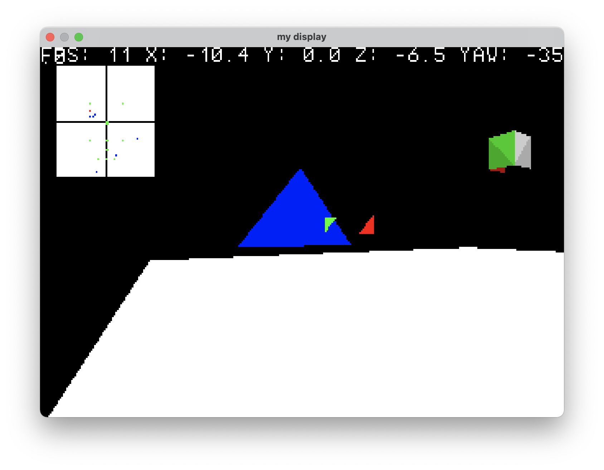

DYI 3D Rendering
----------------

Using simple trigonometry and vector calculations to render a 3d World

## Build

The first time some graphics dependencies have to be downloaded and built. For this the following script has to be executed:

`./setup_dev.sh`

If this whas sucessful, the program can be built by simply calling `make`

With `make test` the program is started after building in debug mode.

## Supported Platforms

Supported are:

* Linux
* macOS
